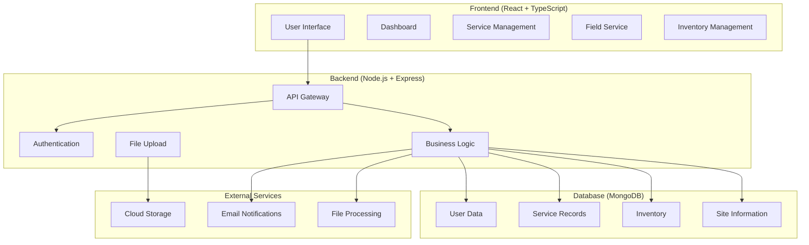
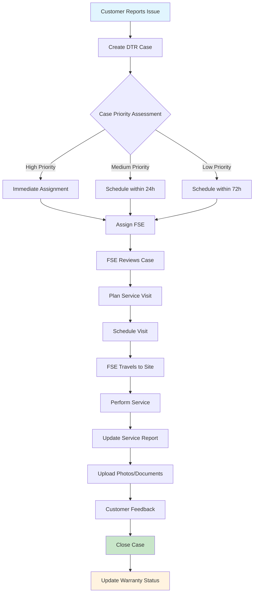
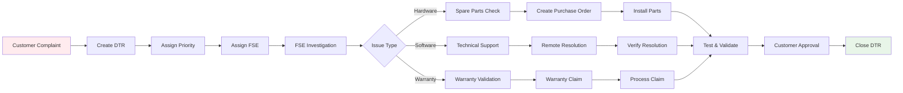
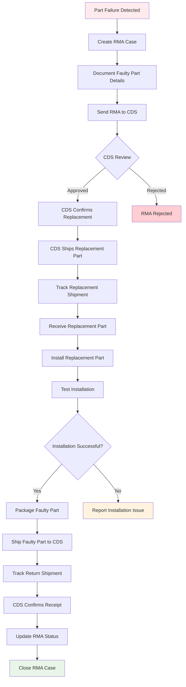
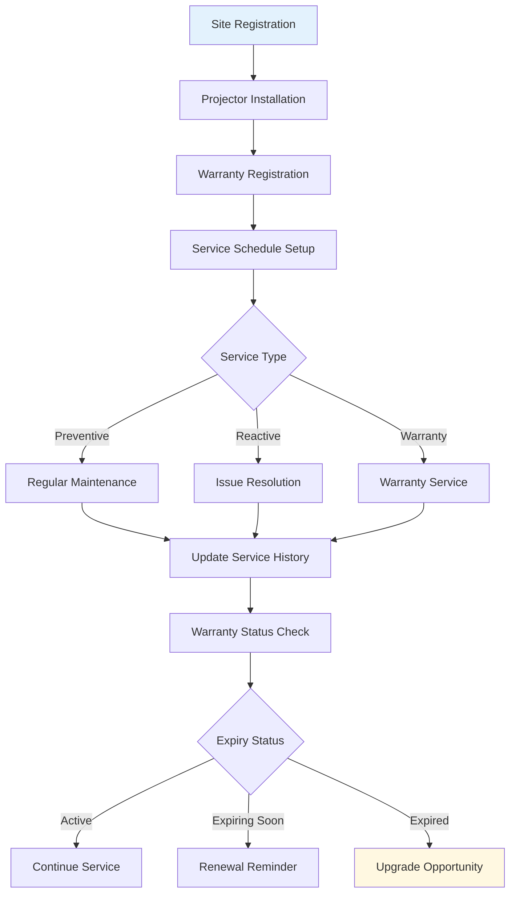
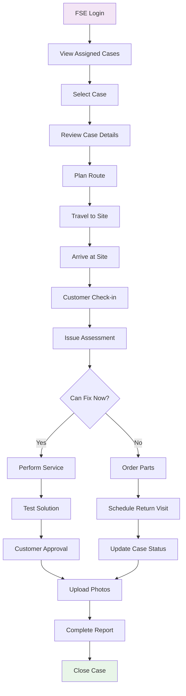
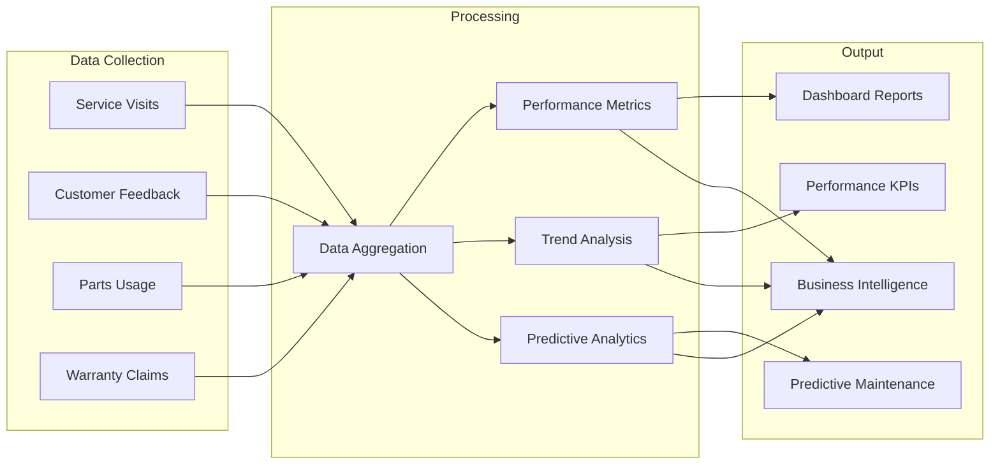
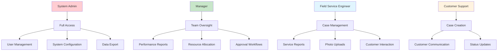
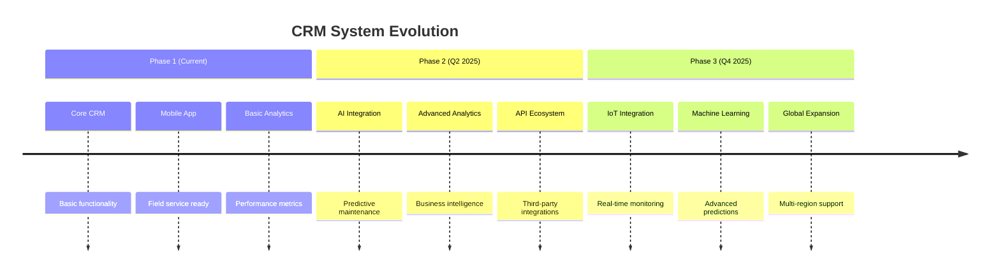

# CRM System Presentation - Flowcharts & Diagrams

## 🎯 System Overview

This CRM system is a **Projector Warranty Management System** designed to streamline projector maintenance, warranty tracking, and field service operations.

---

## 🔄 Core System Architecture

---

## 🚀 Main Workflow - Service Request to Resolution

---

## 📋 DTR (Defect Tracking & Resolution) Process

---

## 🔄 RMA (Return Merchandise Authorization) Process

---

## 🏢 Site Management & Projector Tracking

---

## 👷 Field Service Engineer (FSE) Workflow

---

## 📊 Data Flow & Analytics

---

## 🔐 User Roles & Permissions

---

## 📱 Key Features & Capabilities

### 🎯 **Core Modules**
- **DTR Management** - Defect tracking and resolution
- **RMA Management** - Part replacement with CDS integration
- **Service Visits** - Field service coordination
- **Site Management** - Location and projector tracking
- **Inventory Management** - Spare parts and procurement
- **Warranty Management** - Coverage tracking and claims
- **Reporting & Analytics** - Performance insights

### 🚀 **Advanced Features**
- **Real-time Updates** - Live status tracking
- **Photo Documentation** - Visual service records
- **Route Optimization** - Efficient FSE scheduling
- **Predictive Maintenance** - AI-powered insights
- **Mobile Responsive** - Field-ready interface
- **Cloud Integration** - Secure data storage
- **CDS Integration** - Automated part replacement workflow
- **Dual Part Tracking** - Separate faulty and replacement part management

---

## 💼 Business Value Proposition

### 📈 **Operational Efficiency**
- 40% reduction in service response time
- 60% improvement in first-time fix rate
- 30% decrease in warranty claim processing

### 🎯 **Customer Satisfaction**
- Real-time service status updates
- Proactive maintenance notifications
- Comprehensive service documentation

### 💰 **Cost Optimization**
- Reduced travel and logistics costs
- Optimized spare parts inventory
- Preventive maintenance scheduling

---

## 🔮 Future Roadmap

---

## 📊 Key Performance Indicators (KPIs)

| Metric | Target | Current | Impact |
|--------|--------|---------|---------|
| **Service Response Time** | < 4 hours | 3.2 hours | 🟢 |
| **First-Time Fix Rate** | > 85% | 87% | 🟢 |
| **Customer Satisfaction** | > 90% | 92% | 🟢 |
| **Warranty Claim Processing** | < 48 hours | 36 hours | 🟢 |
| **FSE Utilization** | > 80% | 78% | 🟡 |

---

## 🎯 Conclusion

This CRM system provides a **comprehensive solution** for projector warranty management with:

✅ **End-to-end workflow automation**  
✅ **Real-time visibility and tracking**  
✅ **Mobile-first field service experience**  
✅ **Advanced analytics and reporting**  
✅ **Scalable and secure architecture**  

**Ready for enterprise deployment and immediate value delivery.**
