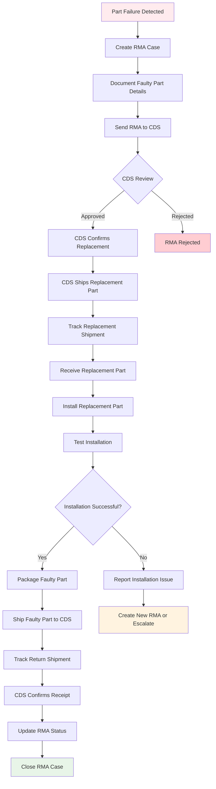
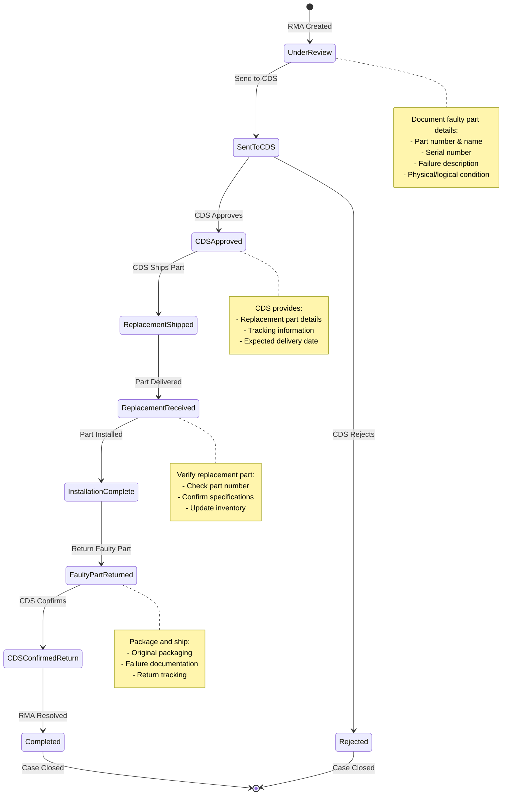
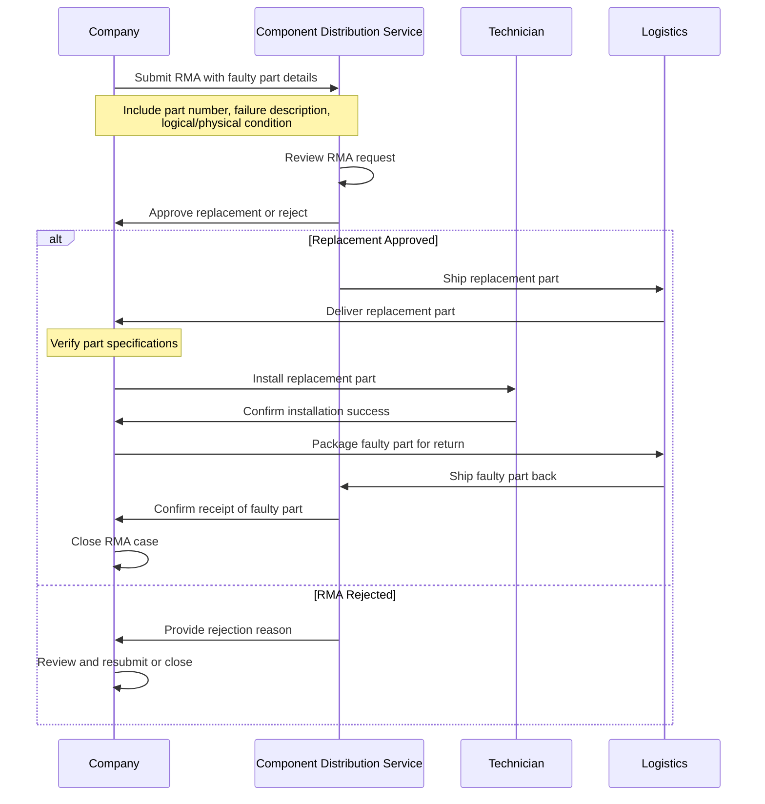

# RMA CDS Workflow - Part Replacement Process

## 🔄 **Complete RMA Workflow with CDS Integration**



---

## 📋 **Detailed RMA Status Flow**



---

## 🏗️ **Enhanced RMA Data Structure**

```
┌─────────────────────────────────────────────────────────────────────────────────┐
│                              RMA DATA MODEL                                    │
├─────────────────────────────────────────────────────────────────────────────────┤
│                                                                                 │
│  ┌─────────────────────────────────────────────────────────────────────────────┐ │
│  │                           FAULTY PART DETAILS                              │ │
│  │  ┌─────────────┐  ┌─────────────┐  ┌─────────────┐  ┌─────────────────────┐ │ │
│  │  │ Part Number │  │ Part Name   │  │ Serial #    │  │ Logical Condition   │ │ │
│  │  │ (Required)  │  │ (Required)  │  │ (Optional)  │  │ (Required)          │ │ │
│  │  └─────────────┘  └─────────────┘  └─────────────┘  └─────────────────────┘ │ │
│  │                                                                             │ │
│  │  ┌─────────────┐  ┌─────────────┐  ┌─────────────────────────────────────┐ │ │
│  │  │ Physical    │  │ Failure     │  │ Additional Notes                     │ │ │
│  │  │ Condition   │  │ Description │  │ & Documentation                      │ │ │
│  │  │ (Required)  │  │ (Required)  │  │                                     │ │ │
│  │  └─────────────┘  └─────────────┘  └─────────────────────────────────────┘ │ │
│  └─────────────────────────────────────────────────────────────────────────────┘ │
│                                                                                 │
│  ┌─────────────────────────────────────────────────────────────────────────────┐ │
│  │                        REPLACEMENT PART DETAILS                            │ │
│  │  ┌─────────────┐  ┌─────────────┐  ┌─────────────┐  ┌─────────────────────┐ │ │
│  │  │ Part Number │  │ Part Name   │  │ Serial #    │  │ Tracking Number     │ │ │
│  │  │ (From CDS)  │  │ (From CDS)  │  │ (From CDS)  │  │ (From CDS)          │ │ │
│  │  └─────────────┘  └─────────────┘  └─────────────┘  └─────────────────────┘ │ │
│  │                                                                             │ │
│  │  ┌─────────────┐  ┌─────────────┐  ┌─────────────────────────────────────┐ │ │
│  │  │ Expected    │  │ Actual      │  │ Delivery Confirmation                │ │ │
│  │  │ Delivery    │  │ Delivery    │  │ & Receipt Details                    │ │ │
│  │  │ Date        │  │ Date        │  │                                     │ │ │
│  │  └─────────────┘  └─────────────┘  └─────────────────────────────────────┘ │ │
│  └─────────────────────────────────────────────────────────────────────────────┘ │
│                                                                                 │
│  ┌─────────────────────────────────────────────────────────────────────────────┐ │
│  │                            CDS WORKFLOW TRACKING                           │ │
│  │  ┌─────────────┐  ┌─────────────┐  ┌─────────────┐  ┌─────────────────────┐ │ │
│  │  │ Sent to CDS │  │ CDS         │  │ Replacement │  │ Faulty Part         │ │ │
│  │  │ Details     │  │ Approval    │  │ Tracking    │  │ Return Tracking     │ │ │
│  │  │             │  │ Details     │  │ Details     │  │ Details              │ │ │
│  │  └─────────────┘  └─────────────┘  └─────────────┘  └─────────────────────┘ │ │
│  └─────────────────────────────────────────────────────────────────────────────┘ │
└─────────────────────────────────────────────────────────────────────────────────┘
```

---

## 📊 **RMA Status Tracking Matrix**

| Status | Description | Actions Required | Next Status |
|--------|-------------|-----------------|-------------|
| **Under Review** | Initial RMA created | Document faulty part details | Sent to CDS |
| **Sent to CDS** | RMA submitted to CDS | Wait for CDS response | CDS Approved/Rejected |
| **CDS Approved** | Replacement approved | Wait for shipment details | Replacement Shipped |
| **Replacement Shipped** | Part shipped by CDS | Track shipment | Replacement Received |
| **Replacement Received** | Part delivered | Install and test | Installation Complete |
| **Installation Complete** | New part installed | Package faulty part | Faulty Part Returned |
| **Faulty Part Returned** | Faulty part shipped back | Track return shipment | CDS Confirmed Return |
| **CDS Confirmed Return** | CDS received faulty part | Update records | Completed |
| **Completed** | RMA fully resolved | Close case | - |
| **Rejected** | CDS rejected RMA | Review and resubmit or close | - |

---

## 🔄 **CDS Communication Workflow**



---

## 📱 **Key Features of Enhanced RMA System**

### ✅ **Separate Part Tracking**
- **Faulty Part**: Original failed component with detailed failure analysis
- **Replacement Part**: New component from CDS with tracking information
- **Logical vs Physical**: Separate assessment of component condition

### 🔄 **Complete CDS Workflow**
- **Bidirectional Communication**: Send RMA, receive approval, return faulty part
- **Tracking Integration**: Monitor both replacement and return shipments
- **Status Progression**: Clear workflow from creation to completion

### 📊 **Enhanced Reporting**
- **Part Failure Analysis**: Track common failure patterns
- **CDS Performance**: Monitor response times and approval rates
- **Cost Tracking**: Track replacement costs and warranty coverage

### 🎯 **Business Benefits**
- **Reduced Downtime**: Faster part replacement process
- **Better Tracking**: Complete visibility of part lifecycle
- **Warranty Optimization**: Proper documentation for warranty claims
- **Inventory Management**: Accurate tracking of replacement parts

---

## 🚀 **Implementation Steps**

1. **Database Migration**: Update existing RMA records to new schema
2. **Frontend Updates**: Modify RMA forms to include new fields
3. **Workflow Integration**: Implement status progression logic
4. **CDS Integration**: Set up communication protocols with CDS
5. **Training**: Educate team on new RMA process
6. **Testing**: Validate complete workflow end-to-end

---

**This enhanced RMA system provides complete visibility into the part replacement process while maintaining proper separation between faulty and replacement components.**
